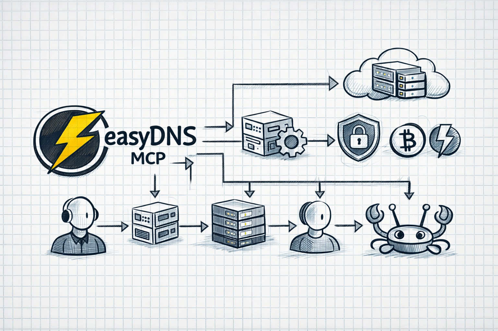

# easyDNS MCP Server

A security-hardened [Model Context Protocol](https://modelcontextprotocol.io) server for the [easyDNS REST API](https://docs.sandbox.rest.easydns.net:3001/). Lets AI agents manage DNS records, domains, mailmaps, and nameservers through a safe, audited interface.

Built for Claude Code, Cowork, OpenClaw, ChatGPT Agent or any other agentic AI. Includes a SKILL.md bash fallback for non-MCP agents.



## Why this exists

DNS is infrastructure. In the not-so-distant future, we think there will be more DNS queries and zone modifications being made by AI agents and intelligent endpoints than by people. 

This server wraps the easyDNS API with:

- **Least privilege by default** — sandbox-only, read-only, all writes disabled out of the box
- **Flat tools** — one tool per action (`dns_record_delete`, not `domain_manage(action: "delete")`), so the agent supervisor sees exactly what's being requested
- **Confirmation strings** — destructive operations require an explicit `confirm` field (`"DELETE"`, `"RELOAD"`, `"UPDATE_NS"`)
- **Domain allowlists/denylists** — lock operations to specific domains, protect critical ones
- **Audit trail** — every tool call logged with correlation ID, never logs credentials
- **Policy enforcement** — RR-type validation, TTL caps, apex CNAME denial, all enforced server-side

## Quick start

```bash
cd easydns-mcp
npm install
npm run build

# Set credentials
cp .env.example .env
# Edit .env with your EASYDNS_TOKEN and EASYDNS_API_KEY

# Run (sandbox read-only by default)
node dist/index.js
```

See [docs/QUICKSTART.md](docs/QUICKSTART.md) for the full setup guide.

## Tools

### Phase A — Read-only (always available)

| Tool | Description |
|------|-------------|
| `domain_list` | List all domains for a user |
| `domain_info` | Get domain details (expiry, service level) |
| `dns_records_list` | List zone records with IDs |
| `dns_records_parsed` | List records in zonefile format |
| `dns_records_search` | Search records by keyword |
| `zone_soa` | Get SOA serial number |
| `nameservers_get` | Get assigned nameservers |
| `mailmaps_list` | List email forwarding rules |
| `registration_status` | Get reglock/renewal status |
| `domain_check` | Check availability and pricing |

### Phase B — Write (requires `EASYDNS_ENABLE_WRITES=true`)

| Tool | Confirm? | Description |
|------|----------|-------------|
| `dns_record_add` | — | Add a DNS record |
| `dns_record_modify` | — | Modify a record by ID |
| `dns_record_delete` | `"DELETE"` | Delete a record by ID |
| `zone_reload` | `"RELOAD"` | Force zone regeneration |
| `nameservers_update` | `"UPDATE_NS"` | Update nameservers |
| `mailmaps_create` | — | Create email forwarding |
| `mailmaps_delete` | `"DELETE"` | Delete a mailmap |

### Resources (read-only reference data)

| URI | Description |
|-----|-------------|
| `easydns://geo-regions` | Geo region IDs for geo-aware records |
| `easydns://service/{id}` | Service level descriptions |
| `easydns://subscription/{id}` | Subscription block descriptions |

## Configuration

All configuration is via environment variables. Everything defaults to the safest option.

```env
# Required
EASYDNS_TOKEN=              # API token
EASYDNS_API_KEY=            # API key

# Optional
EASYDNS_DOMAIN=             # Default domain

# Safety flags (all default to restrictive)
EASYDNS_SANDBOX=true        # Use sandbox API
EASYDNS_ENABLE_WRITES=false # Allow write operations
EASYDNS_ALLOW_PRODUCTION=false
EASYDNS_ALLOW_DOMAIN_DELETE=false
EASYDNS_ALLOW_USER_MUTATIONS=false

# Domain filtering
EASYDNS_ALLOWED_DOMAINS=    # Comma-separated allowlist (empty = all)
EASYDNS_PROTECTED_DOMAINS=  # Comma-separated denylist (never modify)
```

## Phased rollout

| Phase | Config | What works |
|-------|--------|------------|
| A | `SANDBOX=true, WRITES=false` | All read tools |
| B | `SANDBOX=true, WRITES=true` | All tools against sandbox |
| C | `SANDBOX=false, PRODUCTION=true, WRITES=false` | Production reads |
| D | `SANDBOX=false, PRODUCTION=true, WRITES=true` | Scoped production writes |

## Project structure

```
easydns-mcp/
├── src/
│   ├── index.ts            # MCP server entry (stdio transport)
│   ├── auth.ts             # Credential loading
│   ├── client.ts           # HTTP client (fetch + Basic Auth)
│   ├── policy.ts           # Guardrails (allowlist, validation, confirmation)
│   ├── logger.ts           # Structured audit logging
│   ├── types.ts            # API response types
│   ├── schemas.ts          # Zod input schemas for all tools
│   ├── tools/              # One file per tool (17 tools)
│   └── resources/          # MCP resources (3 resources)
├── scripts/                # Hardened bash scripts
├── templates/              # Config templates
├── tests/                  # Policy, client, and security tests
├── docs/                   # QUICKSTART, EXAMPLES
├── SKILL.md                # Agent skill doc (bash fallback)
└── skill.json              # Skill metadata
```

## Bash scripts

Hardened shell scripts in `scripts/` for direct use or non-MCP agents:

```bash
./scripts/list-records.sh example.com
./scripts/domain-info.sh example.com
./scripts/add-record.sh example.com A www 1.2.3.4 600
./scripts/delete-record.sh example.com 12345  # interactive confirm
```

All scripts use `set -euo pipefail`, `umask 077`, HTTPS-only, no redirects, auth via headers (never CLI args).

## Credential management

For **sandbox/lab use**, raw env vars in `.env` or MCP config are fine.

For **production**, don't put secrets in config files. Use a wrapper script that pulls credentials from your system keychain or secrets manager:

```bash
#!/usr/bin/env bash
# scripts/prod-start.sh — production launcher
set -euo pipefail
export EASYDNS_TOKEN=$(security find-generic-password -s easydns-token -w)
export EASYDNS_API_KEY=$(security find-generic-password -s easydns-apikey -w)
export EASYDNS_SANDBOX=false
export EASYDNS_ALLOW_PRODUCTION=true
export EASYDNS_ENABLE_WRITES=true
export EASYDNS_PROTECTED_DOMAINS=critical-domain.com
exec node "$(dirname "$0")/../dist/index.js"
```

Then point your Claude Desktop config at the wrapper instead of inlining secrets:

```json
{
  "mcpServers": {
    "easydns": {
      "command": "/path/to/easydns-mcp/scripts/prod-start.sh"
    }
  }
}
```

This works with macOS Keychain (`security`), 1Password CLI (`op read`), or any other secret store that can emit values to stdout.

## Security model

- Credentials loaded from env only, never logged or passed as CLI args
- `common.sh` is internal — no generic API wrapper exposed
- All HTTP requests use `--proto =https`, `--max-redirs 0`, 30s timeout
- Domain operations validated against allowlist/denylist on every call
- Record types validated against the easyDNS enum (22 types)
- TTL capped to 300–86400 seconds
- CNAME at zone apex blocked (RFC 1034)
- Destructive operations require exact confirmation strings

## Not exposed

These endpoints exist in the API but are deliberately excluded:

- Domain registration/deletion (billing, catastrophic)
- User create/update (account mutations)
- Glue records (registry-level)
- Primary NS changes (delegation-critical)
- Generic REST passthrough

## License

MIT
